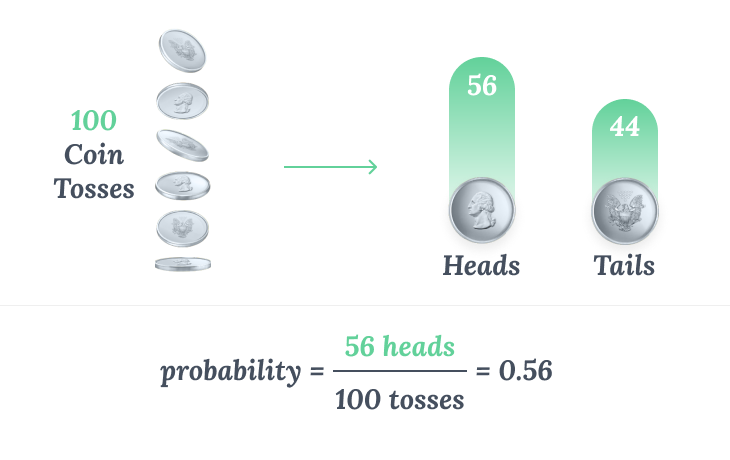

# Probability

### Introduction 

For statistics, random experiment is any process for which we can't predict outcomes with certainty.

We can't predict the outcome of a random experiment, we can at least estimate the probability (the chances) associated with its outcomes

Example Use Case:

> A coin toss has two possible outcomes, and we can estimate the probability associated with the coin landing on heads or tails.

If we're interested in estimating the probability of a coin landing on heads. To estimate the probability:

    1. Toss the coin many times (thus repeating the random experiment).
    2. Count the number of times the coin landed on heads.
    3. Divide the number of heads by the total number of times we tossed the coin.
    4. Dividing the number of heads by the total number of times we tossed the coin gives us the probability of a coin landing heads up.
    
    

### Probabilit(P):
***Event,E***

1. Empirical Probability
$P(E)$ = $\frac{No.of Times Events happened}{No.of Times Experiment Repeated}$

2. Theoretical Probability
$P(E)$ = $\frac{No.of Successful Outcomes}{Total No. of Possible Outcomes}$
